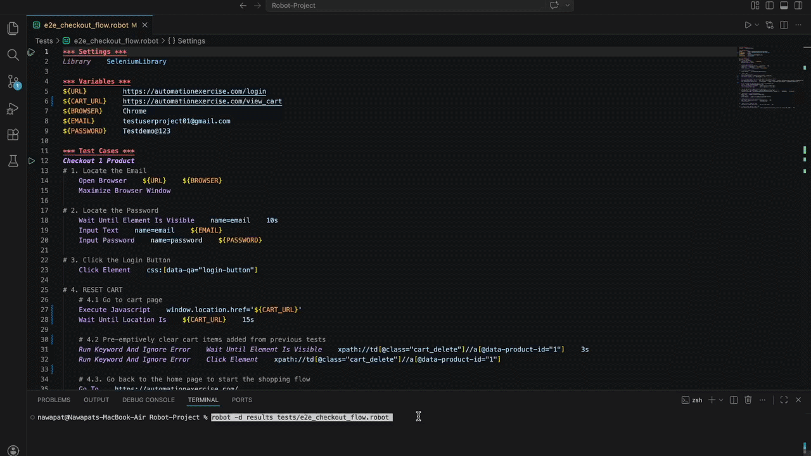

# Automation-Exercise-Robot-Selenium 🛒

**Role:** Automation QA / SDET  
**Tech:** Robot Framework, Selenium, Python  
**Date:** April 2026  
**Status:** Completed  

---

A robust End-to-End (E2E) automation project built with **Robot Framework** and **SeleniumLibrary**. This suite validates the full user journey on [Automation Exercise](https://automationexercise.com/), specifically focusing on login, cart state management, and price verification.

## 📋 Test Scenario: One-Product Checkout Flow (UAT)
This scenario validates the core "Add to Cart" business logic while ensuring test environmental stability.

**Pre-conditions:** * User has a registered account.
* Browser is maximized for consistent element visibility.

### **E2E Test Specification: Automated Checkout & Price Validation:**
1. **Secure Login:** Authenticate using pre-defined credentials via the Login page.
2. **State Reset (Cart Cleanup):** Navigate to the cart to ensure a zero balance, preventing data from previous sessions.
   > **ER-1:** Cart displays "Cart is empty!" and the total is **Rs. 0**.
3. **Product Discovery:** Search for the "Blue Top" on the homepage and scroll the element to the center of the viewport.
4. **Dynamic Interaction:** Trigger the hover overlay and add the product to the cart using its specific product ID.
5. **Cart Navigation:** Transition from the homepage to the Cart View.
6. **Price Validation:** Verify the total amount matches the expected value (**Rs. 500**).
   > **ER-2:** The item "Blue Top" is successfully listed and the final checkout price is exactly **Rs. 500**.

## 🌟 Key Engineering Highlights

This project overcame specific automation hurdles encountered during development—namely **persistent session data**, **layered UI elements**, and **unpredictable ad-overlays**.

* **State Management (Cart Reset):** To handle **persistent data** from previous tests, a pre-test cleanup keyword was implemented. This ensures **Test Isolation**, guaranteeing that price verification is 100% accurate for every execution.
* **Dynamic UI Interaction:** To manage **layered UI elements**, `Mouse Over` and specific XPath indexing were utilized to trigger hidden hover-overlays. This mimics realistic user behavior and ensures reliable element location within a complex DOM.
* **Viewport Handling:** To bypass **ads and visibility challenges**, JavaScript `scrollIntoView({block: "center"})` was implemented. This ensures product elements are perfectly centered and interactable, preventing "Element Not Interactable" errors.

## 🛠️ Tech Stack
* **Framework:** Robot Framework
* **Library:** SeleniumLibrary
* **Language:** Python
* **Drivers:** Chrome WebDriver

## 📂 Project Structure
```text
├── assets/               # Demo GIF and project media
├── tests/                # Robot Framework test suites
│   └── e2e_checkout_flow.robot
├── .gitignore            # Excludes local results/ and pycache/
├── README.md             # Project documentation
├── requirements.txt      # Project dependencies
└── Robot-Project.code-workspace  # VS Code workspace settings
```

## 🚀 Getting Started

### Prerequisites
* **Python 3.8+**
* **Google Chrome** browser
* **ChromeDriver** (Ensure the version matches your installed Chrome browser)

### Installation
1. Clone the repo:
   ```bash
   git clone [https://github.com/nawapats/robot-framework-ecommerce-automation.git](https://github.com/nawapats/robot-framework-ecommerce-automation.git)
   cd robot-framework-ecommerce-automation
2. Install Dependencies
   ```bash
   pip install -r requirements.txt
3. How to Run. 
To execute the test and save results in a dedicated folder:
   ```bash
   robot -d results tests/e2e_checkout_flow.robot

## 📊 Execution Results

To ensure transparency and demonstrate the stability of the script, below is a live recording of the automation execution.



### **Validation Summary**
The following assertions are validated during every run to ensure 100% functional integrity:
- [x] **Login Success:** Verified by successful redirection to the user homepage.
- [x] **State Reset:** Confirmed by "Cart is empty!" message (ER-1).
- [x] **Add to Cart:** Verified by the success modal and dynamic header update.
- [x] **Price Integrity:** Final total confirmed as exactly **Rs. 500** (ER-2).